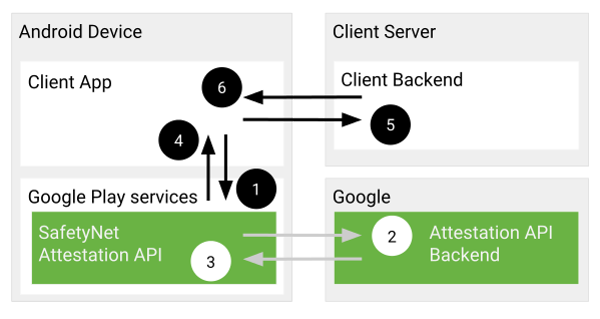
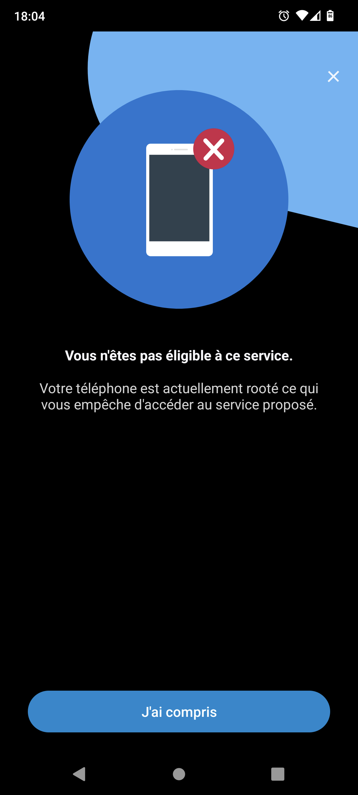
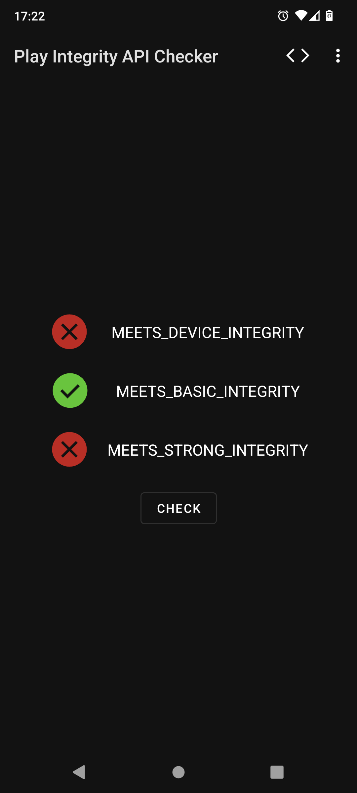
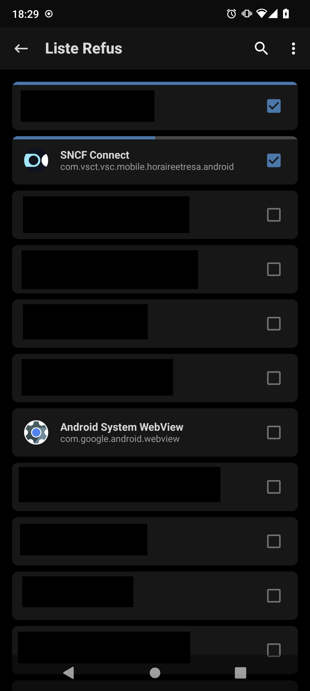
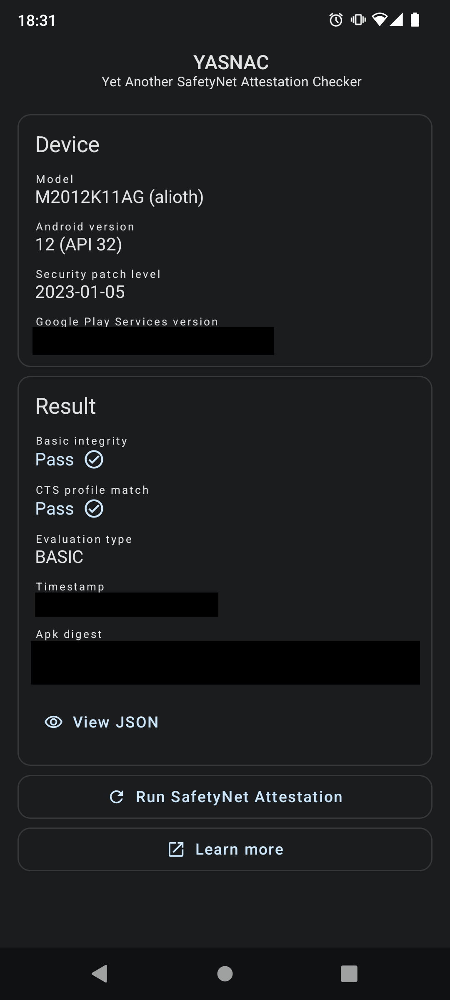
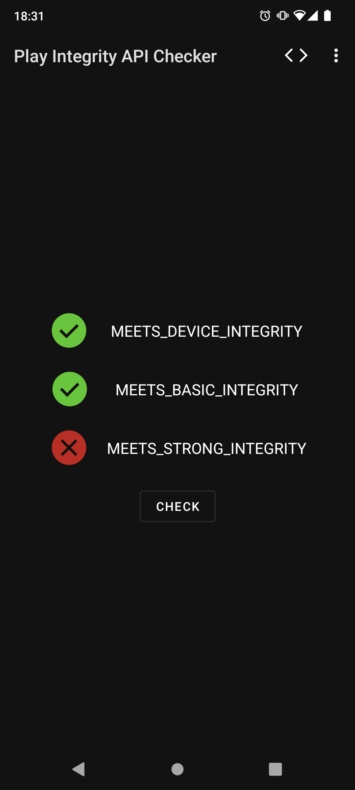

# Contourner SafetyNet Attestation API


---

## Contexte


---

## C'est quoi SafetyNet ?

> **SafetyNet Attestation API** est une API Android … (blahblah) … permet d'évaluer l'intégrité de l'appareil.

---

## Qui l'utilise ?

- SNCF Connect (Pass Navigo)
- Netflix
- Pokémon Go
- Fortnite
- Android Pay
- des apps de banque…

---

## Comment ça fonctionne ?



<!--

1. The SafetyNet Attestation API receives a call from your app. This call includes a nonce.
2. The SafetyNet Attestation service evaluates the runtime environment and requests a signed attestation of the assessment results from Google's servers.
3. Google's servers send the signed attestation to the SafetyNet Attestation service on the device.
4. The SafetyNet Attestation service returns this signed attestation to your app.
5. Your app forwards the signed attestation to your server.
6. This server validates the response and uses it for anti-abuse decisions. Your server communicates its findings to your app.

-->

---

## Quelles sont les vérifications effectuées ?

- **Concordance du profil CTS :**
  - Détection des chargeurs d'amorçage (bootloader) déverrouillés
  - Détection des ROM personnalisées
  - Détections des appareils non certifiés

---

## Quelles sont les vérifications effectuées ?

- **Intégrité basique** :
  - Détection des émulateurs
  - Détection des appareils débridés (root)
  - Détection des cadriciels crochetage

cf. [DroidGuard: A Deep Dive into SafetyNet — Romain Thomas](https://www.sstic.org/2022/presentation/droidguard_a_deep_dive_into_safetynet/)

---

Réponse

```json
{
  "timestampMs": 9860437986543,
  "nonce": "R2Rra24fVm5xa2Mg",
  "apkPackageName": "com.package.name.of.requesting.app",
  "apkCertificateDigestSha256": ["base64 encoded, SHA-256 hash of the
                                  certificate used to sign requesting app"],
  "ctsProfileMatch": true,
  "basicIntegrity": true,
  "evaluationType": "BASIC",
  "deprecationInformation": "..."
}
```

---

`evaluationType` 2 valeurs possibles :

- `BASIC` basée sur les mesures et données de références
- `HARDWARE_BACKED` utilise des fonctionnalités de sécurité matérielles comme les clés d'attestation matérielles (> Android 8.0 / API 26)

---

## Pourquoi la contourner ?

Pour accéder aux applications qui font la vérification et qui nous bloque dans les cas suivants :

- ROM personallisée
- Téléphone débridé (_root_)
- Les deux à la fois
- Souvent pas possible ou souhaitable de re-verrouiller le chargeur d'amorçage (_bootloader_)

---

## En gros pour pas voir ça 😡



---

## À l'attaque !


---

- `basicIntegrity` : ne pose pas de problème, facile à contourner 😎
- `ctsProfileMatch` : potentiellement plus complexe 🫤

---

## Comment contourner

- Usurper l’empreinte de l'appareil (`ro.build.fingerprint`)
- Usurper le niveau de correctif de sécurité `ro.build.version.security_patch` (date)
- Usurpation du modèle `ro.product.model` ➕ d'autres trucs

---

## MagiskHide Props Config

Module Magisk utilisant `resetprop`

https://github.com/Magisk-Modules-Repo/MagiskHidePropsConf

---

```
MagiskHide Props Config v6.1.2
by Didgeridoohan @ XDA Developers

=====================================
 Select an option below.
=====================================

1 - Edit device fingerprint
2 - Force BASIC key attestation
3 - Device simulation (disabled)
4 - Edit MagiskHide props (active)
5 - Add/edit custom props
6 - Delete prop values
7 - Script settings
8 - Collect logs
u - Perform module update check
r - Reset all options/settings
b - Reboot device
e - Exit

See the module readme or the
support thread @ XDA for details.

Enter your desired option:
```

---

Et les attestations matérielles (Android > 8) ?

---


---

## Universal SafetyNet Fix

Module Magisk

https://github.com/kdrag0n/safetynet-fix

Ce module permet de contourner les attestations matérielles de profil CTS SafetyNet et Play Integrity.

---

## Comment ça fonctionne ?

Utilise Zygisk pour injecter du code dans le processus _Play Services_ et enregistre un faux magasin de clés (_keystore_) qui préempte le véritable. 🤔

---

## Qu'est ce que Zygisk ?

- Zygisk (Magisk en Zygote, remplace Magisk Hide)
- Zygote (1er processus au démarrage)
- Cache le débridage sans interagir avec les applications

---

## Fonctionnement d'Universal SafetyNet Fix

Lorsque _Play Services_ tente d'utiliser l'attestation de clé, il lève une exception et prétend que l'appareil ne prend pas en charge l'attestation de clé. 😏

---

Cela oblige _SafetyNet_ à se rabattre sur l'attestation de base, qui est beaucoup plus faible et peut être contournée avec les méthodes existantes. 💪

---

Mais les ingénieurs de Google ne sont pas si bêtes. 🤓 Ça ne va pas fonctionner aussi simplement. 😱

---

Google tiens à jour une base de données sur ses serveurs des appareils qui supportent les attestations basées sur le matériel et va donc bloquer l'attestation basique sur ces appareils. 🛑

---

Ce module va donc ajouter un espace au nom du modèle de l'appareil. Cela va avoir un impact minimal sur l'interface utilisateur et sera appliqué seulement pour _Play Services_ et uniquement dans le cadre de _SafetyNet_. Le nom de modèle ne correspondra donc plus exactement. 💡

---

## Avant

<!--
_header: ''
_footer: ''
-->





```
POCO/alioth_global/alioth:12/SKQ1.211006.001/V13.0.3.0.SKHMIXM:user/release-keys
2023-01-05
```

---

## Après

<!--
_header: ''
_footer: ''
-->






```
POCO/alioth_eea/alioth:12/SKQ1.211006.001/V13.0.9.0.SKHEUXM:user/release-keys
2022-11-01
```

---

## Remerciements

Merci à `Rémi` pour le partage des propriétés d'usine.

---


